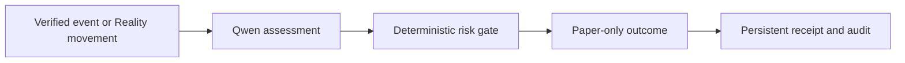

# Noctive UTA Sentinel

Overnight collateral-risk intelligence for tokenized US equities.

**Bitget AI Base Camp Hackathon S2** • **Track**: Agentic Trading • **Sub-theme**: Event-Driven Agent

---

## Review in 90 Seconds

Reviewers and judges can verify Noctive's live evidence, risk boundaries, and proof receipts in under 90 seconds on the public [Noctive Evaluator Pack](https://noctive.vercel.app/evaluator).

### Key Pages & Links
- **Live App**: [https://noctive.vercel.app/](https://noctive.vercel.app/)
- **Evaluator Pack**: [https://noctive.vercel.app/evaluator](https://noctive.vercel.app/evaluator)
- **Market Pulse**: [https://noctive.vercel.app/market-pulse](https://noctive.vercel.app/market-pulse)
- **Overnight Stress Test**: [https://noctive.vercel.app/overnight-stress-test](https://noctive.vercel.app/overnight-stress-test)
- **Decision Ledger**: [https://noctive.vercel.app/decision-ledger](https://noctive.vercel.app/decision-ledger)
- **Competition Log**: [https://noctive.vercel.app/competition-log](https://noctive.vercel.app/competition-log)
- **GitHub Repository**: [github.com/chyokore/noctive](https://github.com/chyokore/noctive)

---

## The Problem

Traditional US stock exchanges close outside regular US equity-market hours and on weekends. However, tokenized US equities (rTokens) continue price discovery 24/7. When major regulatory filings, earnings updates, or thin-market price shifts occur while traditional markets are closed, collateral values can change rapidly. Noctive identifies and surfaces verified overnight rToken movement risk before traditional equity markets reopen.

---

## What Noctive Does

- reads verified Bitget Wallet Reality rToken market inputs;
- combines SEC EDGAR event context and Qwen assessment;
- applies deterministic risk controls;
- records paper-only decisions and run audits.

---

## Event-Driven Agent Loop



---

## System Component & Data Matrix

| Component / Input | Status / Mode | Description |
| :--- | :--- | :--- |
| **Bitget Wallet Reality quotes** | Live, read-only | Verified rToken market data fetched directly from Bitget Wallet. |
| **SEC EDGAR filing context** | Live | Real-time public filing metadata and regulatory context. |
| **Qwen assessments** | Live when invoked | Structured risk assessments generated by Qwen on evaluated receipts. |
| **Risk gates** | Deterministic | Rule-based safety controls enforcing position size, spread, and exposure limits. |
| **Paper orders / PnL** | Simulated only | Simulated paper execution with zero real funds or wallet connections. |
| **Overnight Stress Test** | Fixed illustrative model | Rule-based collateral movement risk interpretation with no user account access. |
| **Historical candles** | Conditional | Displayed only when official authenticated Bitget Wallet Kline data is valid; otherwise unavailable. |

---

## Verification Boundaries

> “Live inputs and decision audits are real. All execution outcomes are paper-only. Noctive does not connect to user wallets, place live orders, or claim real-capital performance.”

---

## Current Validation & Verification

Noctive's repository is backed by automated unit tests, static production builds, and persistent audit logging (`LocalFileLedgerStore` / `DatabaseLedgerStore`).

For live decision counts, simulated PnL, win rate, and real-time execution audits, visit the live [Evaluator Pack](https://noctive.vercel.app/evaluator).

To verify the codebase locally:

```bash
# Run unit test suite
npm test

# Build production bundle
npm run build
```

---

## Local Setup

```bash
# 1. Clone repository
git clone https://github.com/chyokore/noctive.git
cd noctive

# 2. Install dependencies
npm install

# 3. Configure environment variables
cp .env.example .env.local

# 4. Run test suite
npm test

# 5. Build production application
npm run build
```

---

## Hackathon Track Fit

Noctive fits the **Agentic Trading → Event-Driven Agent** track for Bitget AI Base Camp S2:

1. **Sensing**: The agent independently ingests verified market movements and regulatory filing events.
2. **Reasoning**: Qwen synthesizes event context and market depth to propose structured risk actions.
3. **Control**: Independent deterministic risk gates evaluate position limits, spreads, and loss boundaries.
4. **Auditability**: Every decision generates an immutable, dated decision receipt saved to persistent storage.
