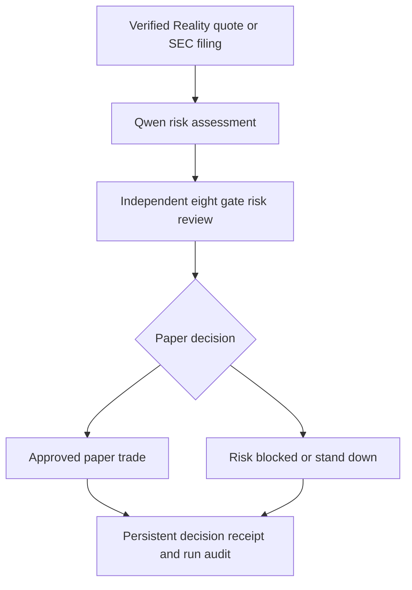

# Noctive UTA Sentinel
Overnight collateral-risk intelligence for tokenized US equities.

**Bitget AI Base Camp Hackathon S2** • **Track**: Agentic Trading • **Sub-theme**: Event-Driven Agent

---

## 1. Overview

Traditional US equity markets can close while tokenized-equity price discovery continues. Noctive identifies verified overnight rToken movement, assesses collateral-risk context, applies deterministic safety controls, and creates auditable paper-only decision receipts before the next market open.

Tokenized US equities (rTokens) trade 24/7. When earnings announcements, regulatory filings, or thin-market price shifts occur overnight or on weekends, tokenized collateral values can move significantly while traditional exchanges remain closed. Noctive bridges this gap by continuously monitoring verified market data, processing filing events, and subjecting every proposed risk response to strict deterministic safety controls.

---

## 2. Submission Summary

- **Live App**: [https://noctive.vercel.app/](https://noctive.vercel.app/)
- **Evaluator Pack**: [https://noctive.vercel.app/evaluator](https://noctive.vercel.app/evaluator)
- **Market Pulse**: [https://noctive.vercel.app/market-pulse](https://noctive.vercel.app/market-pulse)
- **Overnight Stress Test**: [https://noctive.vercel.app/overnight-stress-test](https://noctive.vercel.app/overnight-stress-test)
- **Decision Ledger**: [https://noctive.vercel.app/decision-ledger](https://noctive.vercel.app/decision-ledger)
- **Competition Log**: [https://noctive.vercel.app/competition-log](https://noctive.vercel.app/competition-log)
- **GitHub Repository**: [https://github.com/chyokore/noctive](https://github.com/chyokore/noctive)

---

## 3. Review Noctive in 90 Seconds

Reviewers and judges can verify Noctive in 90 seconds using this step-by-step route:

1. **Start with the Evaluator Pack**: Open [https://noctive.vercel.app/evaluator](https://noctive.vercel.app/evaluator) to inspect the 90-second proof summary, component matrix, and dynamic live evidence snapshot.
2. **Inspect Market Pulse**: Visit [https://noctive.vercel.app/market-pulse](https://noctive.vercel.app/market-pulse) to review verified Bitget Wallet Reality quotes, 24-hour native percentage changes, and authentic Kline candle availability.
3. **Inspect Overnight Stress Interpretation**: Visit [https://noctive.vercel.app/overnight-stress-test](https://noctive.vercel.app/overnight-stress-test) to examine deterministic movement-risk classifications (Stable, Watch, Elevated) and fixed illustrative collateral scenarios.
4. **Open a Live Decision Receipt**: Access [https://noctive.vercel.app/decision-ledger](https://noctive.vercel.app/decision-ledger) and click any receipt to inspect Qwen risk reasoning, active market context, and deterministic risk gate results.
5. **Confirm Competition Run History**: Open [https://noctive.vercel.app/competition-log](https://noctive.vercel.app/competition-log) to verify persistent scheduled run audits, timestamped cycle evidence, and storage layer metadata.

---

## 4. Why Noctive Exists

While traditional US stock exchanges operate during fixed trading hours, tokenized US equities trade around the clock. Over weekends and overnight sessions, market participants face two specific hazards:

- **Unmonitored Collateral Shifts**: Material market events or filing releases during market closures can impact tokenized asset values, creating potential collateral risk before regular exchange hours resume.
- **Speculative Noise & Illiquidity**: Thin overnight order books often generate sharp price spikes that do not reflect true fundamental price discovery.

Noctive is designed explicitly as a risk-intelligence and paper-decision system. It does not predict future price direction or execute live market orders. Instead, it systematically distinguishes between illiquid overnight noise and credible risk events, applying un-bypassable deterministic safeguards to protect simulated collateral postures.

---

## 5. How the Event-Driven Agent Works



### Execution Stage Breakdown

1. **Verified Ingestion**: The agent ingests real-time rToken market inputs from Bitget Wallet Reality endpoints alongside public SEC EDGAR filing event feeds.
2. **Qwen Risk Synthesis**: When a candidate event is evaluated, Qwen processes the qualitative context, market depth, and spread data to propose a structured action (`ENTER_LONG`, `ENTER_SHORT`, or `STAND_DOWN`).
3. **Deterministic Risk Controls**: The proposal enters an independent 8-gate risk engine. The risk engine strictly evaluates position limits, bid-ask spread boundaries, liquidity depth, confidence thresholds, and drawdown limits. **Qwen provides recommendations but has zero authority to bypass or alter risk gate rules.**
4. **Paper-Only Outcome Generation**: If all 8 gates pass, a simulated paper order is generated. If any gate fails, the trade is blocked and recorded with an explicit risk override explanation.
5. **Persistent Audit Receipts**: Every evaluation generates an immutable, timestamped decision receipt stored in persistent ledger history (`LocalFileLedgerStore` or PostgreSQL `DatabaseLedgerStore`).

---

## 6. System Component & Data Matrix

| Component | Mode | What it proves | Boundary |
| :--- | :--- | :--- | :--- |
| **Bitget Wallet Reality rToken quotes** | Live, read-only market input | Real-time rToken prices, 24h percentage change, and chain metadata | Read-only market data; no order execution |
| **SEC EDGAR filings** | Live filing-event context | Authentic corporate filing event context | Filing event source, not stock price data |
| **Qwen risk assessment** | Live risk assessment | Structured AI risk synthesis on evaluated receipts | Risk advisor only; cannot override risk gates |
| **8-gate risk engine** | Deterministic safety control | Position size, liquidity, spread, and drawdown enforcement | Final decision authority; overrides AI proposals |
| **Decision receipts & run audits** | Persistent live evidence | Auditable SHA-256 decision records and scheduled cycle logs | Paper-only historical ledger evidence |
| **Paper execution** | Simulated only | Simulated paper trade execution and PnL tracking | Zero real funds, wallet connection, or live exchange orders |
| **Overnight Stress Test** | Fixed illustrative model | Rule-based rToken movement risk interpretation | Fixed illustrative scenario; not a connected user wallet |
| **Kline candles** | Conditional | Verified historical candle visualization | Displayed only when official signed endpoint returns valid data; never estimated |

---

## 7. Why Judges Should Care

- **Complete Event-to-Decision Loop**: Demonstrates an end-to-end autonomous pipeline from real-world market/event triggers to structured risk analysis, risk-gate evaluation, and paper execution.
- **Strict Separation of AI & Risk Authority**: AI handles qualitative reasoning and context synthesis, while an independent deterministic engine holds final execution authority.
- **Public, Verifiable Evidence**: Every evaluation—whether approved, risk-blocked, or stood down—is recorded in persistent storage and accessible via public audit links.

---

## 8. Current Evidence & Honest Metrics

Current live evidence, decision receipts, and performance metrics are updated dynamically from persistent storage on the [Noctive Evaluator Pack](https://noctive.vercel.app/evaluator).

To maintain strict truthfulness:
- Performance statistics (win rate, Sharpe ratio) are computed only when the persistent ledger contains sufficient closed trade observations.
- If observations are insufficient, metrics explicitly display *"Not yet meaningful — insufficient closed observations"*.
- Noctive makes no claims of real-capital returns, guaranteed profits, or live trading records.

---

## 9. Under-200-Word Project Description

Noctive UTA Sentinel is an overnight collateral-risk intelligence agent for tokenized US equities (rTokens). Traditional equity markets close overnight, but tokenized-equity price discovery continues 24/7. When overnight price movements or regulatory events occur, tokenized collateral values can shift before traditional markets reopen. Noctive ingests verified rToken market quotes directly from Bitget Wallet Reality data and pairs them with SEC EDGAR filing event context. When a genuine event candidate is evaluated, Qwen synthesizes the risk context and proposes a structured paper action. Every proposal is evaluated by an independent, deterministic 8-gate risk engine that enforces position size, spread, liquidity, and exposure limits. Approved actions, risk-blocked proposals, and stand-down decisions generate immutable, dated receipts saved to persistent storage. Noctive operates strictly in paper-trading mode: it does not connect to user wallets, route live exchange orders, or manage real monetary capital.

---

## 10. Hackathon Track Fit

**Bitget AI Base Camp Hackathon S2** • **Track**: Agentic Trading • **Sub-theme**: Event-Driven Agent

Noctive aligns directly with the Event-Driven Agent track requirements:
- **Verified Input**: Ingests real-time market data from Bitget Wallet Reality endpoints and SEC EDGAR filings.
- **AI Assessment**: Qwen performs structured qualitative and quantitative risk synthesis.
- **Deterministic Risk Control**: Independent 8-gate engine enforces un-bypassable risk boundaries.
- **Paper-Only Outcome**: Simulates paper trade executions with zero capital at risk.
- **Auditable Receipt**: Produces persistent, verifiable decision receipts for every cycle.

---

## 11. Verification Boundaries

> “Live inputs and decision audits are real. All execution outcomes are paper-only. Noctive does not connect to user wallets, place live orders, or claim real-capital performance.”

---

## 12. Local Setup & Validation

To clone, inspect, and verify Noctive locally:

```bash
# 1. Clone repository
git clone https://github.com/chyokore/noctive.git
cd noctive

# 2. Install dependencies
npm install

# 3. Run unit test suite (16 test files / 101 tests)
npm test

# 4. Build Next.js production bundle
npm run build
```

---

## 13. Known Limitations

- **Historical Kline Candles**: Displayed only when the official signed Bitget Wallet endpoint returns valid data. If unavailable or unauthenticated, historical candles are omitted rather than estimated or synthetic.
- **Underlying Stock References**: Stooq underlying references are separate reference data points and are never substituted for rToken prices.
- **Scope & Advice Boundary**: Noctive provides risk-intelligence simulation and paper-trading auditability. It does not provide financial or investment advice.

---

## 14. Final Submission Links

- **Live Application**: [https://noctive.vercel.app/](https://noctive.vercel.app/)
- **Evaluator Pack**: [https://noctive.vercel.app/evaluator](https://noctive.vercel.app/evaluator)
- **Market Pulse**: [https://noctive.vercel.app/market-pulse](https://noctive.vercel.app/market-pulse)
- **Overnight Stress Test**: [https://noctive.vercel.app/overnight-stress-test](https://noctive.vercel.app/overnight-stress-test)
- **Decision Ledger**: [https://noctive.vercel.app/decision-ledger](https://noctive.vercel.app/decision-ledger)
- **Competition Log**: [https://noctive.vercel.app/competition-log](https://noctive.vercel.app/competition-log)
- **GitHub Repository**: [https://github.com/chyokore/noctive](https://github.com/chyokore/noctive)
