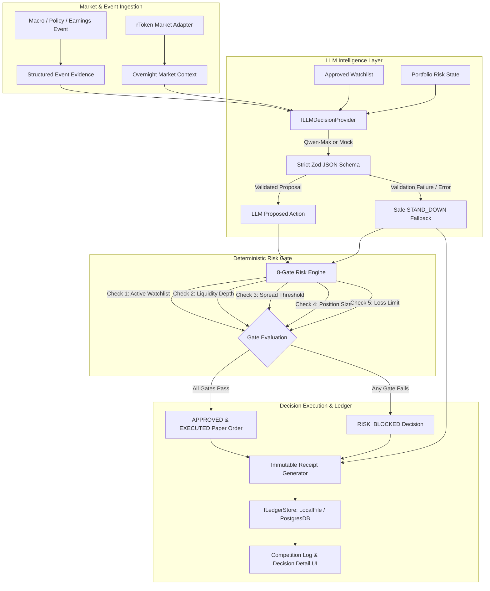

# Noctive - Bitget AI Base Camp S2 Competition Proof Package

## Competition Metadata
- **Hackathon**: Bitget AI Base Camp Hackathon S2
- **Track**: Agentic Trading
- **Sub-Theme**: Event-Driven Agent
- **Application Name**: Noctive (Autonomous Overnight rToken Trading Intelligence Agent)
- **Target Market**: Tokenized US Equities (rTokens) during traditional US market closure hours.

> [!IMPORTANT]
> **SIMULATED PAPER TRADING**: Paper orders are simulated and are not live trades. Noctive contains zero real-money trading, wallet connections, or live exchange order routing.

> [!NOTE]
> **DEMO DATA TRANSPARENCY**: Current event and market scenarios are seeded demo data. All pre-packaged scenarios and mock feeds are explicitly tagged with `Demo Data` or `Simulated Feed` badges.

> [!TIP]
> **LIVE QWEN INFERENCE**: Live Qwen inference verified through the official Bitget endpoint (`https://hackathon.bitgetops.com/v1` / `qwen3.8-max`).

> [!IMPORTANT]
> **SECRET ISOLATION**: No proxy credentials, proxy URLs, or API keys are committed to the project source or documentation.

---

## Live vs. Demo/Mock System Component Matrix

| Component | Status | Description |
| :--- | :--- | :--- |
| **LLM Decision Engine** | **VERIFIED OFFICIAL BITGET QWEN** | Typed `ILLMDecisionProvider` interface (`QwenDecisionProvider`). Configured and verified live against official Bitget endpoint (`https://hackathon.bitgetops.com/v1` / `qwen3.8-max`) via server-side `BITGET_QWEN_API_KEY` in `.env.local`. Verified live with strict Zod JSON parsing. Fallback to `MockLLMDecisionProvider` when key is absent. |
| **Deterministic Risk Engine** | **LIVE** | 8-Gate independent risk validation engine (`riskEngine.ts`) enforcing max drawdown, position size limits, spread thresholds, and liquidity constraints. Final authority over paper orders. |
| **Receipt & Provenance Generator** | **LIVE** | Immutable decision receipt generator (`receiptGenerator.ts`) producing verifiable SHA-256 hashes, timestamps, and full Decision Authority summaries. |
| **Ledger Storage** | **LIVE LOCAL / DEV DB** | `LocalFileLedgerStore` persisting entries to `.data/paper_ledger.json`. `DatabaseLedgerStore` with PostgreSQL migration script (`scripts/init-db.sql`) configured for `DATABASE_URL` (development-only until live DB is connected). |
| **UTA Collateral Sentinel** | **LIVE DETERMINISTIC** | Pure deterministic collateral shock engine (`collateralShockEngine.ts`) calculating pre/post-shock margin coverage ratios and margin buffer classification (`HEALTHY`, `CAUTION`, `CRITICAL`) under illustrative assumptions. |
| **Market Data Adapter** | **SIMULATED** | `MockMarketDataProvider` simulating overnight rToken bid/ask spreads, liquidity indices, and prices. |
| **Order Execution** | **PAPER TRADING ONLY** | Paper order creation only. Zero real-money trading, zero wallet connections, zero live exchange API order routing. |

---

## Agent Architecture Diagram



---

## Autonomous Event-to-Receipt Decision Flow

1. **Event Ingestion**: Overnight events (earnings, SEC filings, macro policy updates) are ingested and assigned structured impact scores.
2. **Context Enrichment**: Current rToken market stats (bid/ask price, spread %, liquidity index) and portfolio risk budgets are assembled into `ILLMDecisionInput`.
3. **LLM Evaluation**: `QwenDecisionProvider` queries Qwen API using server-side credentials with `response_format: { type: 'json_object' }`.
4. **Zod Validation**: Proposal is validated against `LLMDecisionProposalSchema`. Any schema mismatch, unapproved symbol, or missing evidence triggers an immediate `STAND_DOWN` fallback.
5. **Independent Risk Audit**: The proposal enters `RiskEngine.evaluate()`. The 8 deterministic risk gates evaluate market and portfolio rules.
6. **Execution & Receipt Creation**:
   - If approved: A simulated paper order is generated.
   - If blocked by risk: Order is suppressed, and explicit override explanations are recorded.
   - An immutable receipt is saved to `ILedgerStore` with SHA-256 hash and audit provenance.

---

## Screenshot Verification Manifest

All 7 verification screenshots were automatically captured by Playwright and confirmed non-empty:

| Screenshot | Path | Description |
| :--- | :--- | :--- |
| **Landing Page** | `docs/screenshots/landing_page.png` | Product Overview, Live Hero Metrics, Navigation |
| **Command Center** | `docs/screenshots/command_center.png` | Live Event Feed, Watchlist & Portfolio Risk Matrix |
| **Approved Receipt** | `docs/screenshots/decision_receipt_approved.png` | Approved Decision Detail with Decision Authority Panel |
| **Blocked Receipt** | `docs/screenshots/decision_receipt_blocked.png` | Risk Blocked Decision Detail with Override Explanation |
| **Replay Lab** | `docs/screenshots/replay_lab.png` | Historical Event Replay & Gap Simulator |
| **Competition Paper Log** | `docs/screenshots/competition_paper_log.png` | Persisted Paper Ledger & Competition Performance Analytics |
| **Demo Scenarios** | `docs/screenshots/demo_scenarios.png` | Pre-configured Event Simulation Suite |

---

## Remaining External Integrations (Honest System Boundaries)

- **Live Exchange Order Execution**: Currently restricted to paper-trading simulation. No live exchange API keys or automated execution endpoints are connected.
- **Real-Time Webhook Event Feeds**: Events are currently provided via mock adapter and demo event triggers; live SEC EDGAR / news WebSocket streaming is not integrated.
- **Production Cloud PostgreSQL Database**: `DatabaseLedgerStore` and `scripts/init-db.sql` are fully implemented, but production deployment is marked as development-only until a live remote `DATABASE_URL` instance is provisioned.

---

## Verified Execution Commands

```bash
# Run Unit Tests
npm test

# Run Qwen Connection Verification (Live official Bitget endpoint)
npx tsx scripts/test-qwen-connection.ts

# Execute Scheduled Autonomous Paper Trade Cycle
npm run cycle      # (invokes npx tsx scripts/run-paper-cycle.ts)

# Capture All 7 Browser Verification Screenshots
npx tsx scripts/take-screenshots.ts

# Production Next.js Build
npm run build
```

